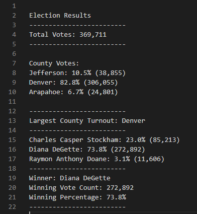

# Analysis of Election Audit
## Overview of Election Audit
The purpose of the election audit analysis is to verify the voting results using python script that runs through the entire voter dataset. Furthermore, the script can also be re-used for similar processes for voter counts and eliminate the use of Excel (current counting/audit process).

## Election Audit Results
- For this congressional election, a total of 369,711 votes were cast.
- Breakdown of county votes as follows:
    - Jefferson County with 38,855 of votes, representing 10.5% of total votes.
    - Denver County with 306,055 of votes, representing 82.8% of total votes.
    - Arapahoe County with 24,801 of votes, representing 6.7% of total votes.
- Denver as shown above, had the highest number of votes across three counties.
- Breakdown of candidate votes as follows:
    - Charles Casper Stockham had 85,213 votes, representing 23.0% of total votes.
    - Diana DeGette had 272,892 votes, representing 73.8% of total votes. 
    - Raymon Anthony Doane had 11,606 votes, representing 3.1% of total votes.

Below is a report generated from the script running through the voter results that verifies the above results:

## Election Audit Summary
Based on the success of the audit, it is our recommendation that a similar process be used for other election audits, whereby we would run a similar script through the voting results. One of the key things to look out when running the same script is to pay attention to the structure of the voting results as the current script looksup candidate & county names based on a relative position in the dataset. One suggestion is to modify the voting results of other elections to match the same structure as the one we had used e.g. a script that changes the column data positioning of its data to match ours (voter id, county, candidate), before running the election audit script. Another suggestion might be to modify our existing script to pull out all the text string results that excludes voter id (identifying it as a number or as too many unique keys inside the dictionary); the idea here is the script does not care about separating county/candidate names, but pulls them all into a report regardless as they are important for our analysis and modify the report later to comform to standards.